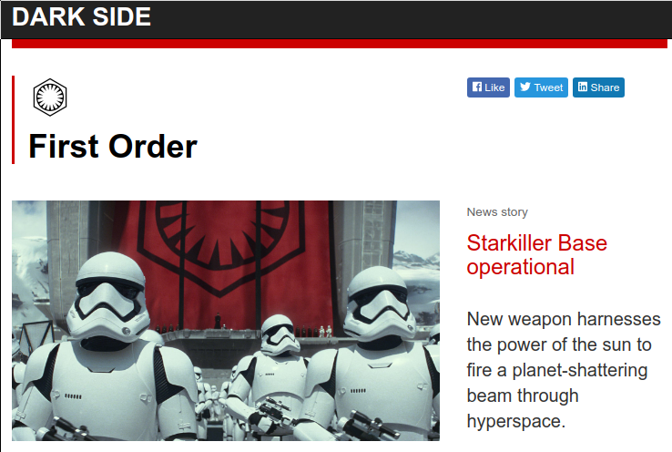
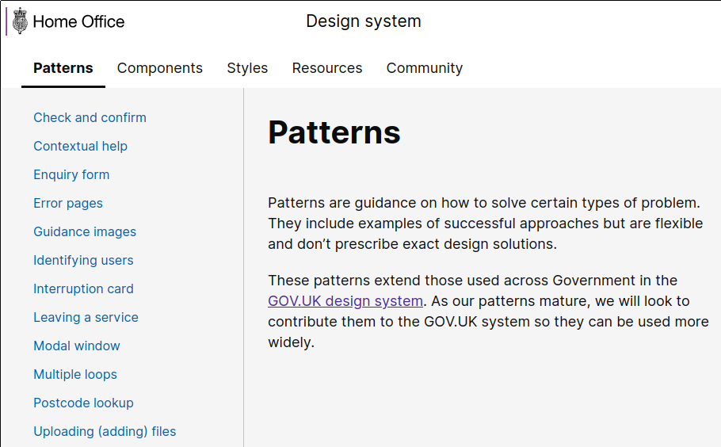
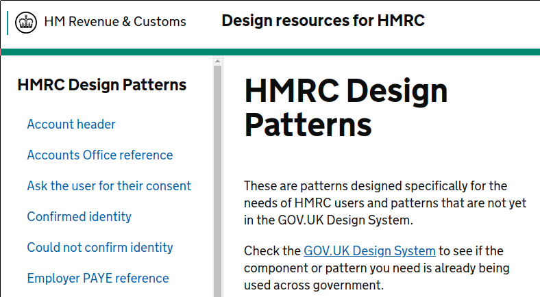

I'm creating a new website that ought to be
[accessible](https://www.gov.uk/guidance/accessibility-requirements-for-public-sector-websites-and-apps).
If only there was some kind of [design
system](https://design-system.service.gov.uk/) developed by a
[website](https://gov.uk/) that [constantly improves its
accessibility](https://www.gov.uk/help/accessibility).  If only that design
system were [available for
everyone](https://www.gov.uk/service-manual/design/making-your-service-look-like-govuk#if-your-service-isnt-on-govuk).

The documentation about the GOV.UK design system doesn't yet give much advice
about creating websites without GOV.UK branding (it's in the
[roadmap](https://design-system.service.gov.uk/roadmap/)), so I asked for
examples of off-brand websites.  The first answer was [The First Order](https://yiu.co.uk/starwars/).

All the other answers were *other design systems* in the UK Civil Service.

